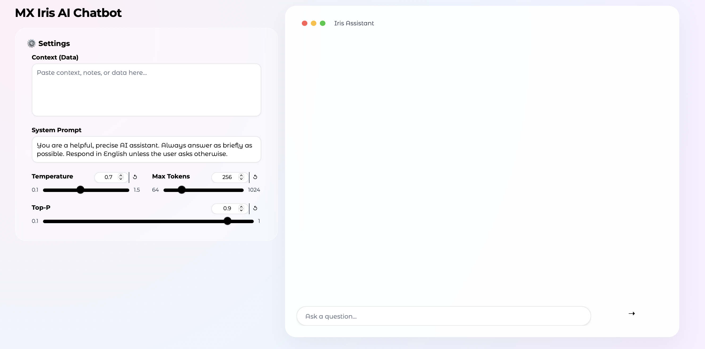

# Iris Assistant - Custom AI Solution (Llama 3)

This repository hosts Iris Assistant, a specialized conversational interface designed to interact with a fine-tuned Llama 3.2 (3B) model.

The primary objective of this project is to demonstrate a complete pipeline for creating domain-specific Large Language Models (LLMs). While this demonstration model was trained on high-quality public instruction data, the architecture serves as a proof-of-concept for enterprises to securely fine-tune models on proprietary data and inject context in real-time.

---

## Live Demo

Interact with the fine-tuned model via the custom interface hosted on Hugging Face Spaces:

---

## Interface Preview

The application features a minimalist design focused on usability and parameter control.

---
## The Development Process

This solution was built following a structured pipeline to optimize a general-purpose model into a responsive assistant.

### 1. Model Selection and Optimization
We utilized the Llama 3.2 3B Instruct architecture as the base. To ensure efficient training without sacrificing performance, we employed the Unsloth library, which allows for faster backpropagation and lower memory usage.

### 2. Dataset and Fine-Tuning
The model was fine-tuned using the mlabonne/FineTome-100k dataset. This large-scale dataset was converted into the standard Conversation format to improve the model's ability to follow complex instructions and maintain coherent dialogue. We utilized QLoRA (Quantized Low-Rank Adaptation) with the following configuration to update specific model weights:
* Rank (r): 16
* LoRA Alpha: 16
* Target Modules: q_proj, k_proj, v_proj, o_proj, gate_proj, up_proj, down_proj

### 3. Quantization and Export
Post-training, the model was merged and exported to GGUF format using llama.cpp. This step ensures the model can be deployed in resource-constrained environments (CPU execution) while maintaining inference speed.

### 4. Interface and Dynamic Context
The frontend allows users to perform Retrieval-Augmented Generation (RAG) manually. By using the "Context" panel on the left, users can inject temporary data (documents, internal wikis, project notes) into the system prompt. This allows the model to answer questions based on information it was not originally trained on, simulating a private enterprise environment.

## Model Evaluation

To validate the training stability and generation quality, we performed a quantitative evaluation using a distinct subset of the data.

### Methodology
We selected a random sample of 150 entries from the FineTome-100k dataset to serve as a validation set. The evaluation was conducted using the SFTTrainer from the TRL library. Crucially, we employed the train_on_responses_only technique, ensuring that the loss was calculated solely on the assistant's generated responses, masking the user's input prompts to prevent artificial inflation of metrics.

### Results
The evaluation yielded the following performance metrics:

* Evaluation Loss: 0.6947
* Perplexity: 2.003

A perplexity score near 2.0 indicates that the model has a strong grasp of the instruction-following structure and is predicting the next token in the conversational sequence with high confidence.

## Application Features

* Dynamic Context Injection: Real-time integration of user-provided text into the generation loop.
* System Prompt Configuration: Ability to override the base personality and instructions of the assistant.
* Inference Parameters: Granular control over Temperature, Max Tokens, and Top-P sampling.
* Visual Design: Custom CSS implementation for a modern, distraction-free environment.

## Tech Stack

* Base Model: Meta Llama 3.2 3B
* Training Framework: Unsloth (PyTorch, TRL)
* Interface: Gradio
* Deployment Format: GGUF / Transformers
